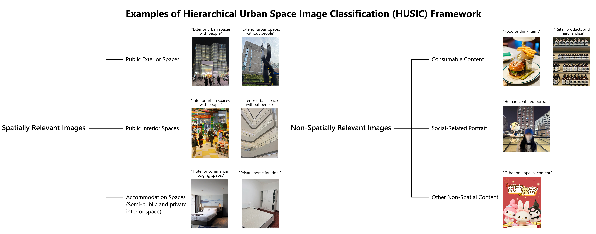
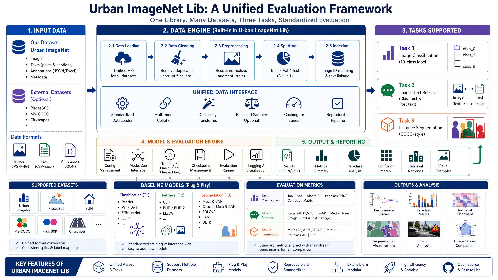
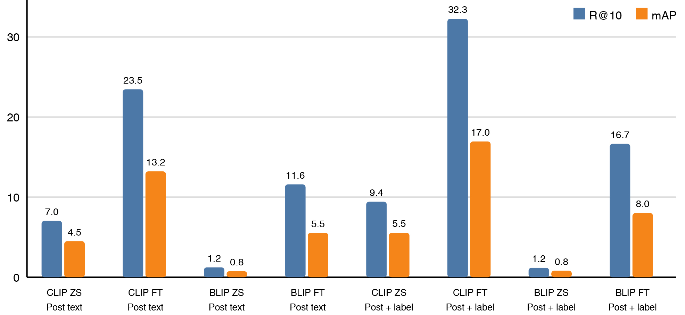
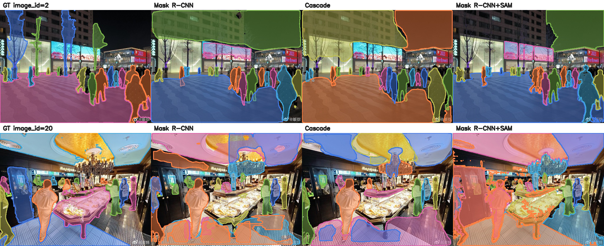

# Urban-ImageNet Benchmark Code

Official benchmark code for **Urban-ImageNet: A Large-Scale Multi-Modal Dataset for Urban Space Perception Benchmarking**.

[](https://arxiv.org/abs/2605.09936)
[](https://huggingface.co/datasets/yiasun/urban-imagenet)
[](https://github.com/yiasun/dataset-2)

Urban-ImageNet is a large-scale multimodal benchmark for urban commercial space perception from public social-media imagery. It contains 2M+ image-text pairs from 61 commercial sites across 24 Chinese cities and is organized by the 10-class **HUSIC** taxonomy. This repository provides the released benchmark code for three tasks and a lightweight `Urban-ImageNet-lib` adapter layer for reproducible comparison with external datasets.


## Repository Layout

```text
.
|-- Figures/              # README figures
|-- task1/                # Urban scene semantic classification baselines
|-- task2/                # Multi-positive image-text retrieval baselines
|-- task3/                # Class-agnostic instance segmentation baselines
|-- urban_imagenet_lib/   # Shared taxonomy, manifests, metrics, and adapters
|-- requirements.txt
`-- README.md
```

The dataset files, pretrained model weights, checkpoints, and generated outputs are intentionally not stored in GitHub. Download the released data from the HuggingFace dataset page and point the scripts to your local paths.

## HUSIC Taxonomy

HUSIC defines 10 urban-space classes designed for social-media imagery: exterior/interior commercial space with or without people, accommodation, private interiors, food/drink, portraits, retail products, and other non-spatial content. The taxonomy is intended as a routing layer for urban analysis rather than a generic object vocabulary.



## Urban-ImageNet-lib

The paper describes **Urban-ImageNet-lib** as a unified benchmark layer. In this repository it is implemented as a lightweight, auditable Python package that provides:

- shared HUSIC class names and CLIP-style prompts;
- a common JSONL/CSV manifest format for image, text, label, and annotation records;
- adapters for Urban-ImageNet, Places365, MS-COCO, and Cityscapes;
- small metric helpers for classification and multi-positive retrieval;
- command-line manifest generation for cross-dataset sanity checks.



Build manifests:

```bash
python -m urban_imagenet_lib.cli list-adapters

python -m urban_imagenet_lib.cli build-manifest \
  --dataset urban-imagenet \
  --root /path/to/Urban-ImageNet \
  --dataset-size "10K Dataset" \
  --task t1 \
  --split test \
  --out manifests/uinet_t1_test.jsonl

python -m urban_imagenet_lib.cli build-manifest \
  --dataset places365 \
  --root /path/to/Places365 \
  --task t1 \
  --split val \
  --out manifests/places365_val.jsonl

python -m urban_imagenet_lib.cli build-manifest \
  --dataset coco \
  --root /path/to/coco \
  --task t3 \
  --split val2017 \
  --out manifests/coco_val2017.jsonl

python -m urban_imagenet_lib.cli build-manifest \
  --dataset cityscapes \
  --root /path/to/cityscapes \
  --task t3 \
  --split val \
  --out manifests/cityscapes_val.jsonl
```

These adapters do not replace the official external-dataset training code. They provide a reproducible interface for comparing dataset composition, splits, labels, and annotation availability across Urban-ImageNet, Places365, MS-COCO, and Cityscapes.

## Installation

For Task 1 and Task 2:

```bash
git clone https://github.com/yiasun/dataset-2.git
cd dataset-2
python -m pip install -r requirements.txt
```

For Task 3, use the MMDetection environment described in `task3/requirements-task3.txt`. A typical Linux GPU setup uses `mim`, `mmdet`, `mmengine`, `mmcv`, `pycocotools`, and the optional Segment Anything dependency for SAM refinement.

## Released Checkpoint

We provide a lightweight Task 1 HUSIC scene-classification checkpoint for reproducible inference. See `models/` for the prediction script and class-index mapping. The `.pth` checkpoint is distributed through GitHub Releases to keep this repository lightweight.

## Task 1: Urban Scene Semantic Classification

**Goal:** predict the 10-way HUSIC scene label from an image.

**Code:** `task1/baseline_image_classification.py`

**Input layout:** ImageFolder-style split directories:

```text
01 Images with labels/
|-- train/<HUSIC class name>/*.jpg
|-- val/<HUSIC class name>/*.jpg
`-- test/<HUSIC class name>/*.jpg
```

Example:

```bash
python task1/baseline_image_classification.py \
  --data_dir "/path/to/100K Dataset/01 Images with labels" \
  --output_dir outputs/task1_efficientnet_b4 \
  --model_name efficientnet_b4 \
  --epochs 20 \
  --batch_size 32
```

Main classification results:

| Model | Top-1 Acc. (%) | Macro-F1 |
|---|---:|---:|
| ResNet-18 | 75.9 | 0.754 |
| ResNet-50 | 79.7 | 0.799 |
| ResNet-152 | 80.5 | 0.804 |
| ViT-B/16 | 79.0 | 0.790 |
| DeiT-B | 80.3 | 0.802 |
| EfficientNet-B4 | **84.9** | **0.849** |
| CLIP ViT-L/14 zero-shot | 37.9 | 0.350 |
| CLIP ViT-L/14 fine-tuned | 69.1 | 0.675 |

CLIP zero-shot is intentionally included as a stress test: HUSIC labels are urban-theory concepts rather than common web categories, so supervised visual models remain stronger.

## Task 2: Cross-Modal Image-Text Retrieval

**Goal:** evaluate image-text alignment under two textual modalities.

**Code:**

- `task2/run_task2_multipositive.py` for CLIP-style baselines.
- `task2/run_task2_multipositive_vlm.py` for BLIP/BLIP-2 style baselines.

Task 2 uses a **multi-positive** protocol because one Weibo post may contain multiple images. For text-to-image retrieval, all images attached to the same post group are correct. For image-to-text retrieval, the corresponding post text/group is correct.

Example CLIP run:

```bash
python task2/run_task2_multipositive.py \
  --dataset-root "/path/to/Urban-ImageNet" \
  --dataset-size "10K Dataset" \
  --split test \
  --text-source post \
  --group-mode auto \
  --output-dir outputs/task2_clip_post
```

Example fine-tuning run:

```bash
python task2/run_task2_multipositive.py \
  --dataset-root "/path/to/Urban-ImageNet" \
  --dataset-size "10K Dataset" \
  --text-source label \
  --group-mode label \
  --do-finetune \
  --epochs 3 \
  --batch-size 16 \
  --output-dir outputs/task2_clip_label_ft
```

Main retrieval results on the 10K split:

| Setting | Model | R@1 | R@5 | R@10 | mAP | MedR |
|---|---|---:|---:|---:|---:|---:|
| T2-A category label | CLIP zero-shot | 54.2 | 96.5 | 100.0 | 53.3 | 1.5 |
| T2-A category label | CLIP fine-tuned | 92.7 | 99.8 | 100.0 | 90.7 | 1.0 |
| T2-A category label | BLIP zero-shot | 14.9 | 43.6 | 80.0 | 19.8 | 6.2 |
| T2-A category label | BLIP fine-tuned | **94.2** | **99.8** | **100.0** | **93.3** | **1.0** |
| T2-B post text | CLIP zero-shot | 2.6 | 5.4 | 7.0 | 4.5 | 328 |
| T2-B post text | CLIP fine-tuned | **8.1** | **16.9** | **23.5** | **13.2** | **64** |
| T2-B post text | BLIP zero-shot | 0.1 | 0.4 | 1.2 | 0.8 | 477 |
| T2-B post text | BLIP fine-tuned | 1.9 | 6.8 | 11.6 | 5.5 | 92 |
| T2-B post + label diagnostic | CLIP fine-tuned | **9.3** | **22.8** | **32.3** | **17.0** | **25** |



Category-label retrieval confirms that HUSIC class definitions are visually discriminative. Post-text retrieval remains much harder because social-media posts are narrative, incomplete, and often only loosely tied to the attached image.

## Task 3: Instance Segmentation

**Goal:** evaluate instance segmentation on the Task 3 subset under a **class-agnostic** protocol. All object instances are merged into a single `object` category, which avoids incorrectly treating HUSIC scene labels as object categories.

**Code:**

- `task3/tools/prepare_t3_dataset.py` converts the released COCO annotations into class-agnostic MMDetection-ready splits.
- `task3/run_t3.py` builds and trains MMDetection configs.
- `task3/tools/eval_t3_metrics.py` evaluates Mask R-CNN/Cascade outputs.
- `task3/models/sam_refine_mmdet_boxes.py` uses predicted detector boxes as SAM prompts.
- `task3/scripts/run_clean_1k_pipeline.sh` is the clean Linux reproduction script for the final working pipeline.

Prepare data:

```bash
python task3/tools/prepare_t3_dataset.py \
  --image-root /path/to/raw_images \
  --ann-root /path/to/raw_annotations \
  --out-root /path/to/t3_1k_class_agnostic \
  --mode class_agnostic \
  --recompute-bbox \
  --overwrite-images
```

Train and evaluate Mask R-CNN:

```bash
python task3/run_t3.py \
  --model mask_rcnn \
  --data-root /path/to/t3_1k_class_agnostic/annotations \
  --img-root /path/to/t3_1k_class_agnostic/images \
  --work-dir outputs/mask_rcnn_class_agnostic_clean \
  --epochs 8 \
  --batch-size 2 \
  --auto-classes \
  --lr 0.0002 \
  --warmup-iters 50 \
  --num-workers 2

python task3/tools/eval_t3_metrics.py \
  --config outputs/mask_rcnn_class_agnostic_clean/mask_rcnn_auto.py \
  --checkpoint outputs/mask_rcnn_class_agnostic_clean/epoch_8.pth \
  --ann /path/to/t3_1k_class_agnostic/annotations/test.json \
  --img-root /path/to/t3_1k_class_agnostic/images \
  --model-name "Mask R-CNN class-agnostic" \
  --out-dir outputs/t3_metrics/mask_rcnn_class_agnostic_clean \
  --score-thr 0.001
```

Clean full Task 3 pipeline:

```bash
export RAW_IMAGE_ROOT=/path/to/raw_images
export RAW_ANN_ROOT=/path/to/raw_annotations
export PREP_ROOT=/path/to/t3_1k_class_agnostic
export OUT_ROOT=/path/to/t3_outputs

bash task3/scripts/run_clean_1k_pipeline.sh
```

Add SAM refinement by setting `SAM_CHECKPOINT=/path/to/sam_vit_b_01ec64.pth` before running the same script.

Main Task 3 results:

| Method | Protocol | Box AP | Mask AP | AP50 | AP75 | Notes |
|---|---|---:|---:|---:|---:|---|
| Mask R-CNN | automatic | 38.6 | 26.7 | 47.2 | 27.6 | Stable detector-style baseline |
| Cascade Mask R-CNN | automatic | **41.4** | 29.0 | 49.5 | 29.9 | Strongest conventional detector |
| Mask R-CNN boxes + SAM | automatic hybrid | -- | **37.3** | 56.3 | 37.8 | Best fully automatic mask baseline |
| Cascade boxes + SAM | automatic hybrid | -- | 36.9 | 53.1 | 38.0 | Similar hybrid baseline |
| SAM with GT boxes | oracle upper bound | -- | 74.9 | 92.4 | 80.5 | Uses ground-truth boxes; not deployable |



The gap between predicted-box SAM and ground-truth-box SAM indicates that localization, rather than mask boundary quality, is the main bottleneck. This is consistent with a useful but challenging pseudo-label benchmark.

## Reproducibility Notes

- Keep Task 3 class-agnostic unless you are explicitly studying object vocabulary quality.
- Do not evaluate HUSIC scene labels as instance categories.
- Use multi-positive grouping for Task 2 post-level retrieval.
- Scripts write outputs under user-specified folders; checkpoints and generated predictions are ignored by `.gitignore`.
- The clean Task 3 shell script is preferred for reproducible reruns.

## Responsible Use

Urban-ImageNet is intended for non-commercial academic research in computational urban studies and machine perception. Do not use the dataset for re-identification, surveillance, face recognition, account reconstruction, or commercial profiling.

## Citation

```bibtex
@article{ou2026urbanimagenet,
  title   = {Urban-ImageNet: A Large-Scale Multi-Modal Dataset and Evaluation Framework for Urban Space Perception},
  author  = {Ou, Yiwei and Cheung, Chung Ching and Ang, Jun Yang and Ren, Xiaobin and Sun, Ronggui and Gao, Guansong and Zhao, Kaiqi and Manfredini, Manfredo},
  journal = {arXiv preprint arXiv:2605.09936},
  year    = {2026},
  eprint  = {2605.09936},
  archivePrefix = {arXiv},
  primaryClass  = {cs.CV},
  url     = {https://arxiv.org/abs/2605.09936}
}
```
